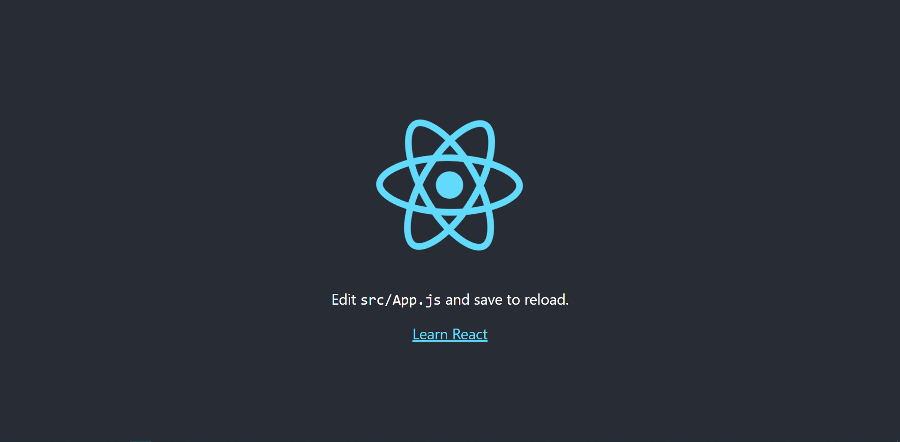

<br/>
<div class="Mdxcontainer">

---

Youtube Video coming soon

---

## pre-requisites

<a href="" class="read-link"></a>

- Basic knowledge of HTML, CSS, and Javascript
- <a href="https://nodejs.org/en/download/" class="read-link">node</a> or <a href="https://classic.yarnpkg.com/en/docs/install/#windows-stable" class="read-link">yarn</a> installed on device
- <a href="https://code.visualstudio.com/Download" class="read-link">VS Code</a> or any other IDE of your choice

## installing modules

For running a React apps we need react itself, react-dom which is the react document object model, and a bundler, we can use any bundler but for tutorial this we would be using react-scripts which is the bundler provided in the default react app.

we can continue in 2 ways, we can either run 
<br/>

<div class="code-block">

``` shell

  npx create-react-app my-first-react-app

```

</div>

<br/>

this would create the default react app which would look like the following picture after running yarn start command inside the folder



 or we can make an empty folder and initialize our folder with 
 
<br/>

<div class="code-block">

``` shell

  npm init

```

</div>
<br/>
 
 
 and then install the packages we need by either of running  
<br/>


<div class="code-block">

``` shell

  npm install react react-dom react-scripts
  yarn add react react-dom react-scripts

```

</div>

<br/>

 for starting with a completely blank folder i would go with the later. You can also copy these node script and paste it in your package.json then your package.json would look somewhat like

<br/>

<div class="code-block">

``` JSON
{
  "name": "first-react",
  "version": "1.0.0",
  "description": "",
  "main": "src/index.js",
  "scripts": {
    "start": "react-scripts start",
    "build": "react-scripts build",
    "test": "react-scripts test"
  },
   

  "author": "",
  "license": "ISC",
  "dependencies": {
    "react": "^17.0.1",
    "react-dom": "^17.0.1",
    "react-scripts": "^4.0.1"

  }
}

```

</div>

<br/>

## setting up the folder

Minimum requirement for running a react app is a **src** folder containing an index.js and a **public** containing an index.html file. we can also add a favicon ,images or a manifest.json to the public folder

first we would create our public folder and add the index.html inside it.
<br/>

<div class="code-block">

``` HTML

<!DOCTYPE html>
<html lang="en">
<head>
    <meta charset="UTF-8">
    <meta name="viewport" content="width=device-width, initial-scale=1.0">
    <title>Document</title>
</head>
<body>
    <div id="root">not rendered</div>
</body>
</html>

```
</div>

<br/>
Reacts need a div tag to render our app inside of. whatever is written inside the div is displayed when the app is not rendered and would be over written if the app is rendered.

now we would create index.js in the src folder. firstly you need to import React and render function.
<br/>

<div class="code-block">

``` HTML

import React from 'react';
import {render} from 'react-dom'

```
</div>

<br/>

You only need the render function from react-dom so you would implicitly import it.

## The 2 types of components 

there are 2 ways in which you can create a react component
- class component
- functional component

### Class component

it is a class which inherit from react class known as component which already exists in React. components can render with a function inside React called createElement or we can write JSX aka Javascript XML where the later is preferred due to ease in workflow. Here is a basic class component

<br/>

<div class="code-block">

``` React

class App extends React.Component {
  render() {
    return <h1>Hello World</h1>;
  }
}

```
</div>

<br/>

### Functional component

After the hooks becoming a stable api functional components are usually preffered over class components, but both have their own pros and cons. It is essentially a function that is returning JSX. Here is a basic functional component 

<br/>

<div class="code-block">

``` React

const App =()=> {
    return <h1>Hello World</h1>;
}

```
</div>

<br/>

or 
  
  <br/>

<div class="code-block">

``` React

function App() {
    return <h1>Hello World</h1>;
}

```
</div>

<br/>

## Rendering the components

To render the components we would use the render function which we imported earlier. It has the following syntax
 <br/>

<div class="code-block">

``` React

render(component,element to be rendered in)

```
</div>

<br/>

So we can write the following code to render our App component 
<br/>

<div class="code-block">

``` React

render(<App/>,document.getElementById('root'))

```
</div>

<br/>

## Running the app 

Now to test the app run eitherof the 3 commands in the terminal

<br/>

<div class="code-block">

``` React

npm start
yarn start
react-scripts start

```
</div>

<br/>

If you've followed correctly till now you've successfully created your first react app 🎉🎊🎉

</div>
