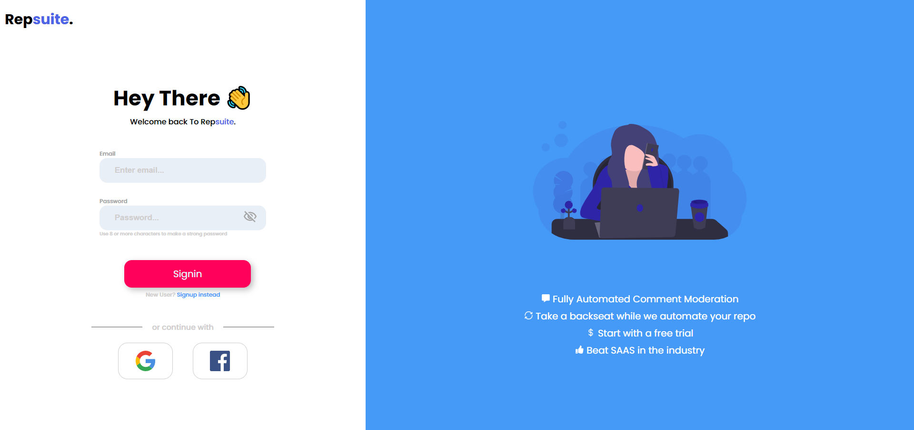
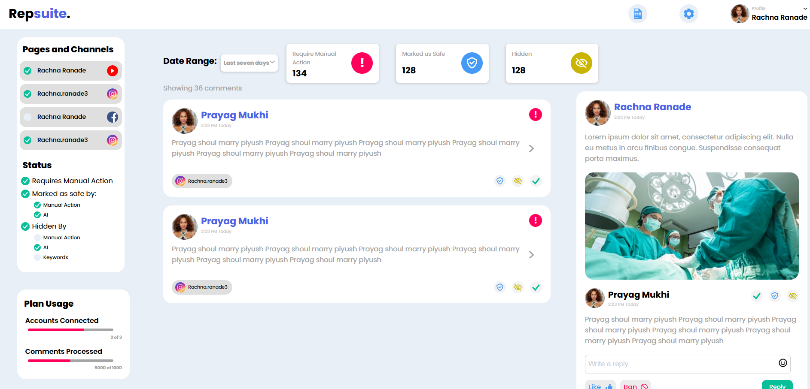

import AniLink,{Styleda} from "../../../src/components/read-link.js";

 

<Styleda href="https://pensive-bose-5abc42.netlify.app/">Visit the Project</Styleda>

## When was it built

This was build as the final round internship test for MERN stack developer at IOSD in february 2k20.

 

## Objective

UI made for first round of IOSD MERN stack developer internship.

 

## Technologies used

- Reactjs
- scss  

