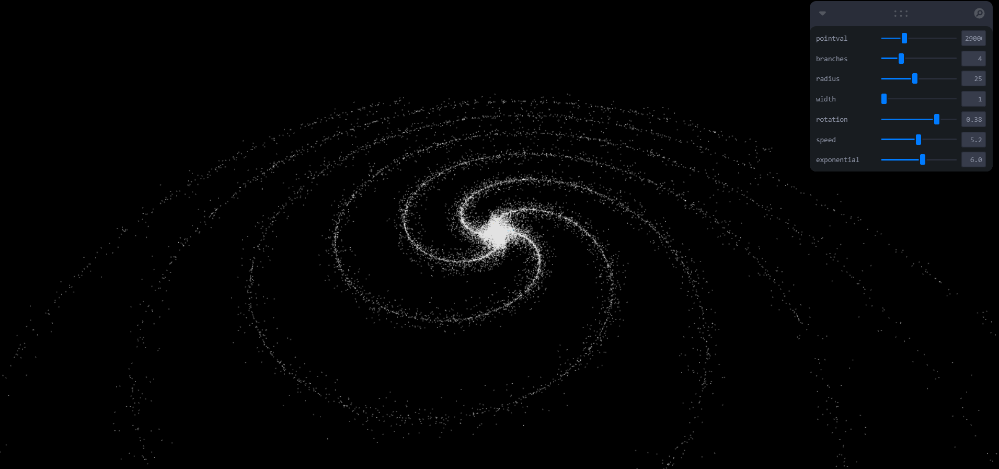

import { Styleda } from '../../../src/components/read-link.js';

<Styleda href="https://angry-cori-d4c66c.netlify.app/">
  Visit the Project
</Styleda>

## Why was it built

This was built as a project for fun.

 

## Objective

A customisable galaxy generator for 3D in web

 

## Technologies used

- Three js
- React Three Fiber
- TypeScript
- Reactjs
