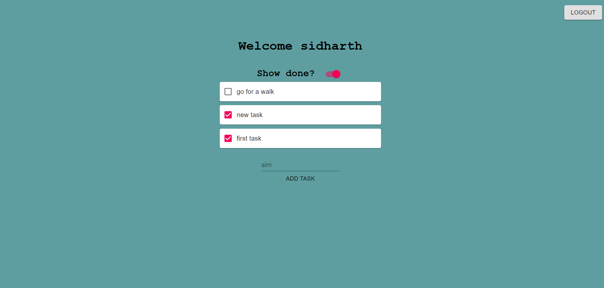
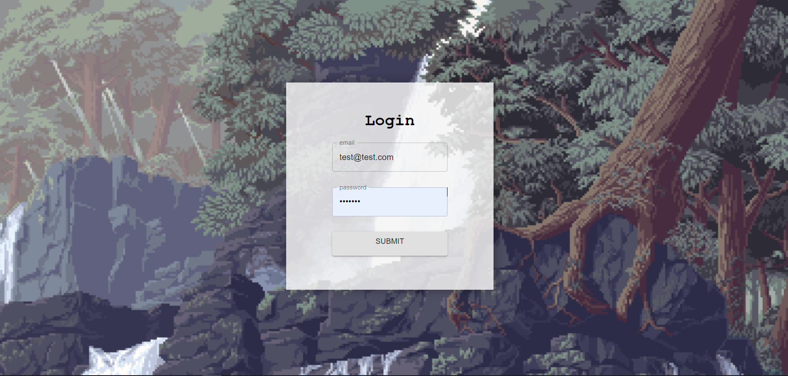

 

## Why was it built

This was built as a graphql and react tutorial.

 

## Objective

this was a TODO app built for revision of CRUD operation with mongo

 

## Technologies used

- GraphQL
- Nodejs
- React
- Apollo Server
- Apollo Client
