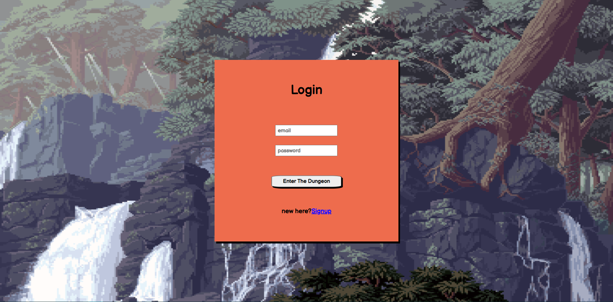

 

## When was it built

This application was built during Healthathon hackathon which was held from 24/10/2020 to 21/11/2020.

 

## Objective

The main objective of the application was to create a dashboard for people to enter their habits, daily goals, and to-dos and earn experience points upon completion which unlock skins for the character they have created.

 

## Technologies used

- Reactjs
- Firebase

 
