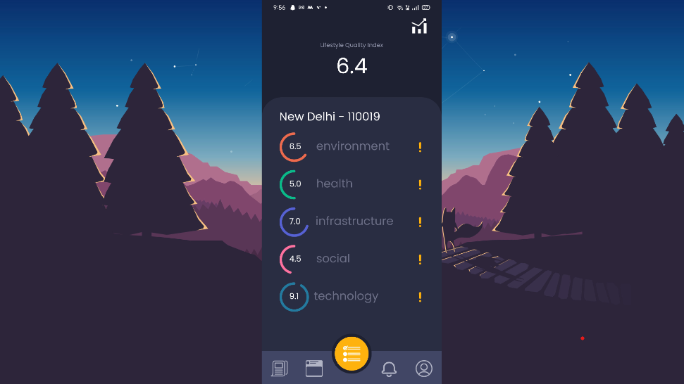

 

## When was it built

Currently under development
 

## Objective

The objective is to provide the local government the data related to their region of governance and allow the citizens to get their voices heard and help in better allocation of the government's resources. 

 

## Technologies used

- React Native
- Firebase

 
