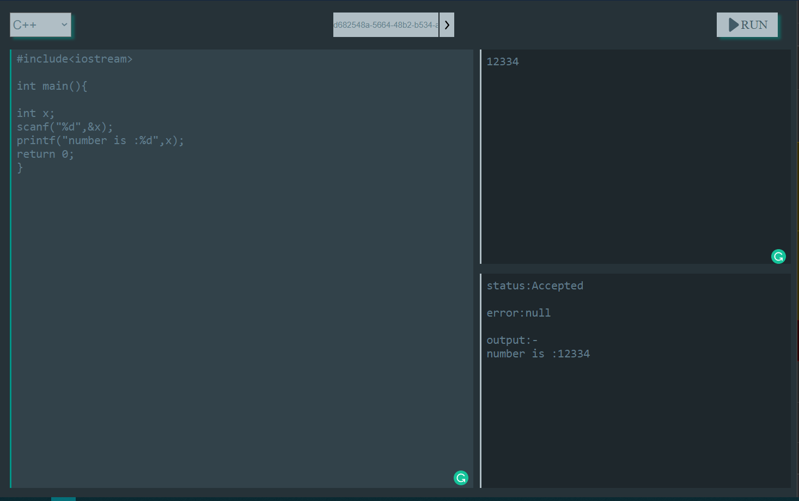

import AniLink,{Styleda} from "../../../src/components/read-link.js";

<Styleda href="https://pensive-hodgkin-94af6c.netlify.app/">Visit the Project</Styleda>

## When was it built

This was build as the final round internship test for MERN stack developer at IOSD in February 2k20.

 

## Objective

online IDE for C++, Java, Python which was build as the final round internship test for MERN stack developer at IOSD.

 

## Technologies used

- Reactjs
- Judge0 api
- sass

