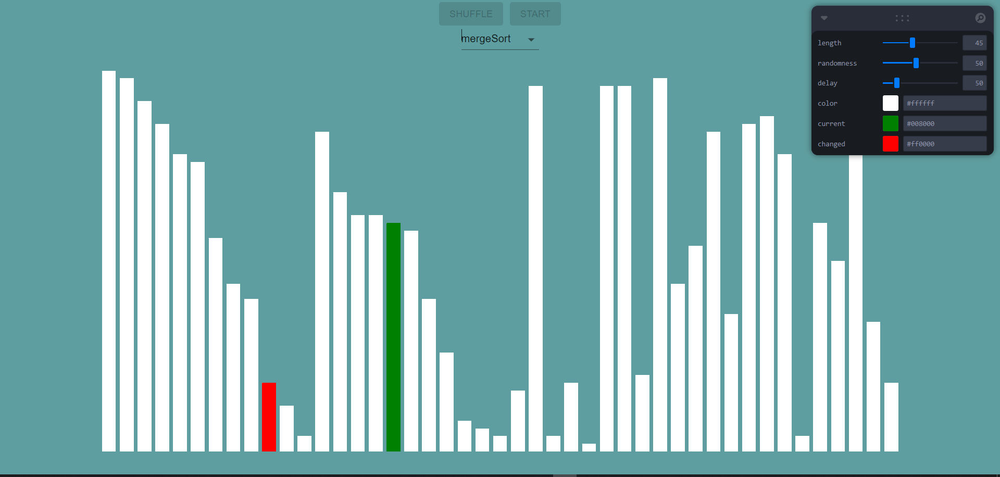

import { Styleda } from '../../../src/components/read-link.js';

<Styleda href="https://elastic-shaw-6ecd3b.netlify.app/">
  Visit the Project
</Styleda>

## Why was it built

This was built as a project for fun.

 

## Objective

this app gives a visual output about how the list looks after each itteration to show
how the sorting algoritm actually works

 

## Technologies used

- TypeScript
- Reactjs
