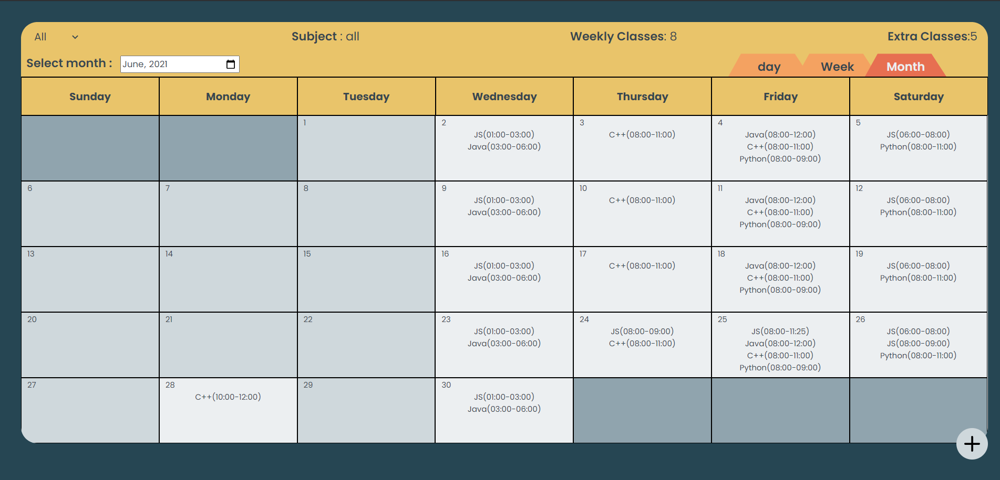

import { Styleda } from '../../../src/components/read-link.js';

<Styleda href="https://peaceful-montalcini-dd037d.netlify.app">
  Visit the Project
</Styleda>

## When was it built

This application was built during pepcoding webdev intern hiring 21/06/2021 to 25/06/2021.

 

## Objective

it is a graphical interface to interact, see and schedule classes for teachers.

 

## Technologies used

- TypeScript
- Reactjs
- Nodejs
- Express
- MySQL
