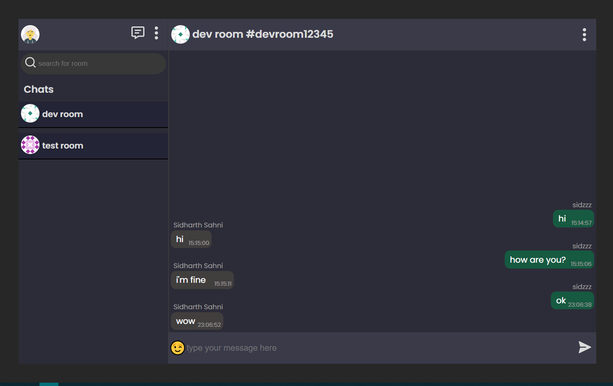

import AniLink,{Styleda} from "../../../src/components/read-link.js";

<Styleda href="https://chatroom-eba87.web.app/">Visit the Project</Styleda>

## When was it built

this was build in the month of january 2k21

 

## Objective

its a realtime chatapp base on top of firestore

 

## Technologies used

- Reactjs
- Firebase

