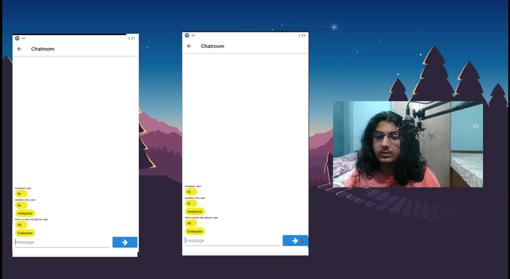

import { Styleda } from '../../../src/components/read-link.js';

<Styleda href="https://www.linkedin.com/posts/sidharth-sahni-77951b191_fullstack-reactnative-graphql-activity-6810825441989980161-GZkZ">
  Visit the linkedin post
</Styleda>

## Why was it built

This was built as a project for fun.

 

## Objective

this is a chatapp which works without a database which increase the security at the cost of no data retension.

 

## Technologies used

- TypeScript
- React Native
- GraphQL
- Apollo Server
- Nodejs
