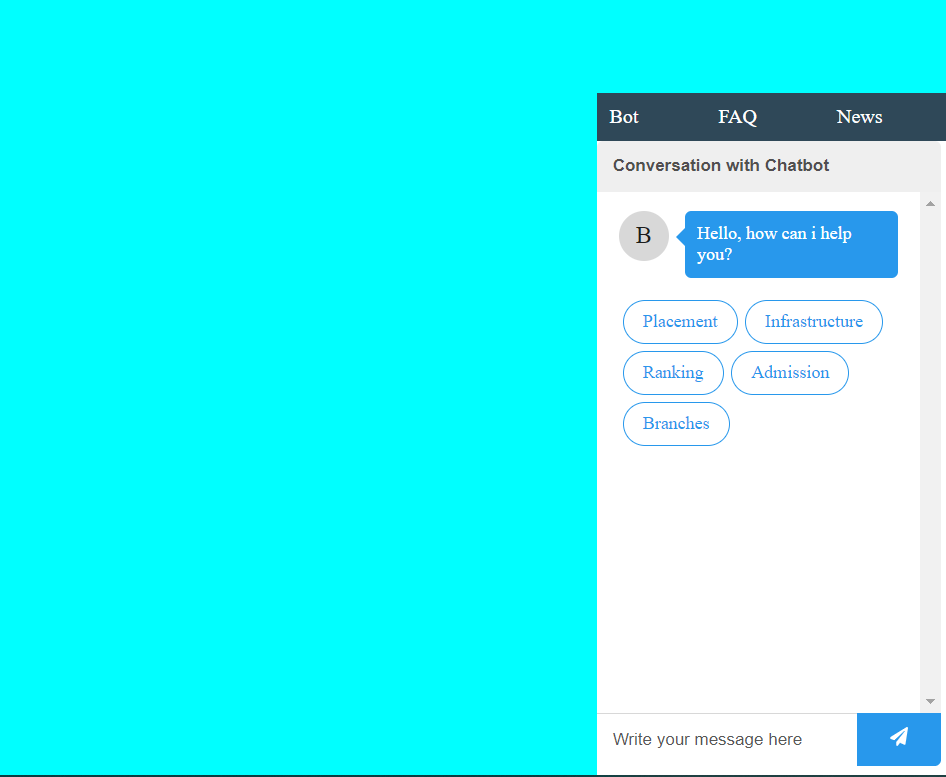

## When was it built

This application was built during Unscript hackathon which was held from 21/11/2020 to 22/11/2020.

 

## Objective

this was a chatbot built for proving information for the students interested in gaining knowledge about the institute which got me runner-up position in the hackathon

 

## Technologies used

- Reactjs
- Firebase
- React-chatbot-kit
